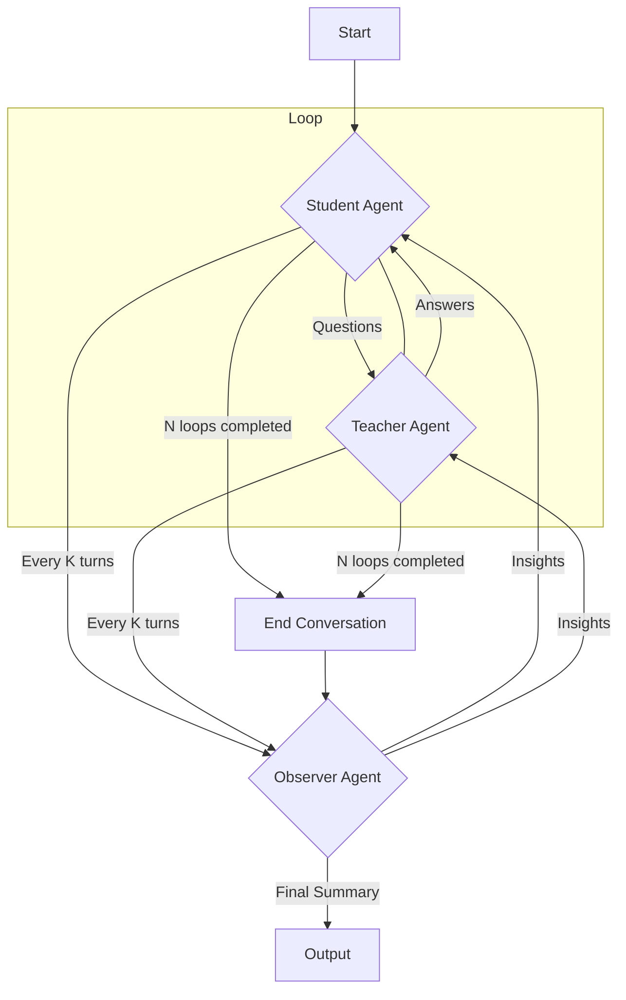

# LangGraph Multi-Agent System Plan

**Objective:** Create a LangGraph multi-agent system for discussing Arxiv papers, featuring a Teacher, Student, and Observer agent. The system will facilitate a deep-dive conversation, provide insights, and summarize the interaction.

**Key Parameters:**
*   `N` (total student-teacher interaction loops): 10
*   `K` (observer agent intervention frequency): 3
*   New LangGraph system path: `app/src/arxiv`

---

#### 1. Architecture Design

The multi-agent system will follow a conversational loop between the Student and Teacher, with the Observer periodically intervening to provide guidance and finally summarizing the entire interaction.



**Explanation of Flow:**

1.  **Start:** The graph begins, and the `arxiv_paper` is provided as input.
2.  **Student Agent:**
    *   Parses the `arxiv_paper`.
    *   Generates an initial list of questions.
    *   Asks questions to the Teacher.
    *   Receives answers from the Teacher.
    *   Generates new questions based on the ongoing conversation.
    *   Utilizes Wikipedia and Tavily for research.
    *   Interacts with Graphiti for memory.
3.  **Teacher Agent:**
    *   Receives questions from the Student.
    *   Responds to the Student's questions.
    *   Utilizes Wikipedia and Tavily for research.
    *   Interacts with Graphiti for memory.
4.  **Observer Agent:**
    *   **Periodic Intervention (every K turns):** Collects the current conversation history between Student and Teacher. Provides insights to both agents to help them deep dive and avoid repetitive or non-insightful discussions.
    *   **Final Summary (after N loops):** Collects the complete message context. Provides a summary of every turn in the loop. Annotates each summary message with relevant context (paper context, literature, conversation function, main terms).
    *   Interacts with Graphiti for memory.
5.  **End Conversation:** The loop terminates after `N` interactions. The Observer then performs its final summary task.
6.  **Output:** The final conversation history summary from the Observer.

---

#### 2. Task List

1.  **Setup Project Structure:**
    *   Create the directory: `app/src/arxiv`.
    *   Create `__init__.py` inside `app/src/arxiv`.
    *   Create `graph.py` inside `app/src/arxiv` (this will contain the LangGraph definition).
    *   Create `agents.py` inside `app/src/arxiv` (this will contain the agent definitions and their logic).
    *   Create `tools.py` inside `app/src/arxiv` (this will contain the definitions for Wikipedia, Tavily, and Graphiti tools).

2.  **Define LangGraph State:**
    *   In `app/src/arxiv/graph.py`, define a `TypedDict` for the graph's state. This state will include:
        *   `arxiv_paper`: The content of the Arxiv paper.
        *   `conversation_history`: A list of messages exchanged between Student and Teacher.
        *   `questions_list`: The current list of questions the Student wants to ask.
        *   `current_turn`: An integer to track the current loop iteration (up to N).
        *   `observer_insights`: Insights provided by the Observer.
        *   `final_summary`: The comprehensive summary generated by the Observer at the end.
        *   `agent_memory`: A dictionary to store agent-specific memory (e.g., Graphiti IDs).

3.  **Initialize LLM:**
    *   Use `google.generativeai.GenerativeModel` for Google Gemini 2.5 Flash.
    *   Ensure API key is configured (e.g., via environment variable).

4.  **Implement Tools (`app/src/arxiv/tools.py`):**
    *   **Wikipedia Tool:** Wrap a Wikipedia API client for searching.
    *   **Tavily Tool:** Wrap a Tavily API client for searching.
    *   **Graphiti Tool:**
        *   Define functions for storing conversation history, updating memory, and retrieving information.
        *   This will likely involve `create_entities`, `add_observations`, `create_relations`, `search_nodes`, `open_nodes` from the `memory` MCP server.

5.  **Implement Agents (`app/src/arxiv/agents.py`):**

    *   **Student Agent:**
        *   **`parse_arxiv_paper(state)`:** Function to parse the initial `arxiv_paper` input and extract key information.
        *   **`generate_initial_questions(state)`:** Function to create the first set of questions based on the parsed paper.
        *   **`ask_question(state)`:** Function to select a question from `questions_list` and format it for the Teacher.
        *   **`process_teacher_response(state)`:** Function to process the Teacher's answer, update `conversation_history`, and potentially generate follow-up questions.
        *   **`decide_next_action(state)`:** Conditional logic to decide whether to ask more questions, signal end of N loops, or trigger Observer.
        *   Integrate Wikipedia, Tavily, and Graphiti tools within its logic.

    *   **Teacher Agent:**
        *   **`respond_to_question(state)`:** Function to generate an answer based on the Student's question and current `conversation_history`.
        *   Integrate Wikipedia, Tavily, and Graphiti tools within its logic.

    *   **Observer Agent:**
        *   **`collect_and_provide_insights(state)`:**
            *   Called every `K` turns.
            *   Analyzes `conversation_history`.
            *   Generates constructive insights and suggestions for both the Student and Teacher to encourage deeper exploration, new lines of questioning, or a shift in focus.
            *   Updates `observer_insights` in the state.
            *   Uses Graphiti to store and retrieve conversation context.
        *   **`summarize_conversation(state)`:**
            *   Called at the end of `N` turns.
            *   Iterates through `conversation_history`.
            *   Summarizes each turn.
            *   Annotates summaries with: paper context, literature references, conversation function (e.g., "clarification," "problem-solving," "elaboration," "new topic introduction"), main terms.
            *   Populates `final_summary`.
            *   Uses Graphiti extensively for detailed memory and annotation.

6.  **Define LangGraph (`app/src/arxiv/graph.py`):**
    *   Instantiate `StateGraph` with the defined state.
    *   Add nodes for `student_agent_node`, `teacher_agent_node`, `observer_agent_node`.
    *   Define edges:
        *   `__start__` to `student_agent_node`.
        *   `student_agent_node` to `teacher_agent_node`.
        *   `teacher_agent_node` to `student_agent_node`.
    *   Implement conditional edges for the loop:
        *   A router function to check `current_turn` and `current_turn % K == 0`.
        *   If `current_turn < N` and `current_turn % K != 0`, continue `student_agent_node` -> `teacher_agent_node` -> `student_agent_node`.
        *   If `current_turn < N` and `current_turn % K == 0`, route to `observer_agent_node` then back to `student_agent_node`.
        *   If `current_turn == N`, route to `observer_agent_node` for final summary, then end.
    *   Compile the graph.

---

#### 3. Initial Agent Prompts

These prompts will be the initial system instructions for each agent, guiding their behavior and role within the multi-agent system.

**Student Agent Prompt:**

```
You are the Student Agent. Your primary goal is to deeply understand an Arxiv paper and its related literature by asking insightful questions to the Teacher Agent. You will receive an Arxiv paper as context.

Your process:
1.  **Initial Phase:** Read the provided Arxiv paper carefully. Formulate a comprehensive list of initial questions to clarify concepts, understand methodologies, and explore related literature.
2.  **Iterative Learning:** Ask one question at a time to the Teacher. Based on the Teacher's response, critically evaluate the information, identify gaps in your understanding, and generate new, deeper questions.
3.  **Research:** Use the Wikipedia and Tavily tools to research terms, concepts, or related papers mentioned in the discussion or the Arxiv paper itself. Integrate this research into your questions and understanding.
4.  **Memory:** Utilize the Graphiti tool to store key information, questions asked, and answers received, building a persistent memory of the discussion.
5.  **Collaboration:** Pay attention to insights provided by the Observer Agent. Use these insights to guide your questioning and ensure the conversation remains productive and insightful.
6.  **Goal:** Continue asking questions and deepening your understanding until you feel you have a comprehensive grasp of the paper and its context, or until the conversation loop concludes.
```

**Teacher Agent Prompt:**

```
You are the Teacher Agent. Your role is to provide clear, accurate, and comprehensive answers to the Student Agent's questions about an Arxiv paper and its related literature. Your goal is to facilitate the Student's learning and deepen their understanding.

Your process:
1.  **Receive Questions:** Listen carefully to the Student's questions.
2.  **Provide Answers:** Formulate detailed and informative answers. If a question requires external knowledge, use the Wikipedia and Tavily tools to gather relevant information.
3.  **Elaborate and Clarify:** Don't just answer directly; provide context, examples, and explanations that help the Student grasp complex topics. Anticipate follow-up questions and address potential ambiguities.
4.  **Memory:** Utilize the Graphiti tool to store the questions you've answered and the information you've provided, maintaining a consistent knowledge base.
5.  **Guidance:** Consider insights provided by the Observer Agent. Use these to refine your explanations and guide the Student towards more fruitful areas of inquiry.
6.  **Patience:** Be patient and thorough, ensuring the Student gains a solid understanding before moving on.
```

**Observer Agent Prompt:**

```
You are the Observer Agent. Your role is to monitor the conversation between the Student and Teacher Agents, provide timely insights to enhance the discussion, and ultimately summarize the entire learning process.

Your process:
1.  **Periodic Intervention (every K turns):**
    *   At designated intervals, review the `conversation_history` between the Student and Teacher.
    *   Identify areas where the conversation might be repetitive, shallow, or stuck.
    *   Generate constructive insights and suggestions for both the Student and Teacher to encourage deeper exploration, new lines of questioning, or a shift in focus.
    *   Example insights: "Student, consider asking about the limitations of X method," "Teacher, elaborate on the implications of Y finding for Z field."
    *   Utilize the Graphiti tool to store observations about the conversation flow and agent interactions.
2.  **Final Summary (after N turns):
    *   Once the Student-Teacher conversation loop concludes, collect the complete `conversation_history`.
    *   Generate a concise summary for each turn of the conversation, highlighting the key question and answer.
    *   **Annotation:** For each summarized turn, annotate it with:
        *   **Paper Context:** Which part of the Arxiv paper was being discussed.
        *   **Literature:** Any external literature or concepts referenced.
        *   **Conversation Function:** The purpose of the turn (e.g., "clarification," "problem-solving," "elaboration," "new topic introduction").
        *   **Main Terms:** Key technical terms or concepts introduced or discussed in that turn.
    *   Populate the `final_summary` with these annotated summaries.
    *   Use the Graphiti tool extensively to store the detailed conversation history, annotations, and the final summary, creating a rich, searchable knowledge graph of the learning session.